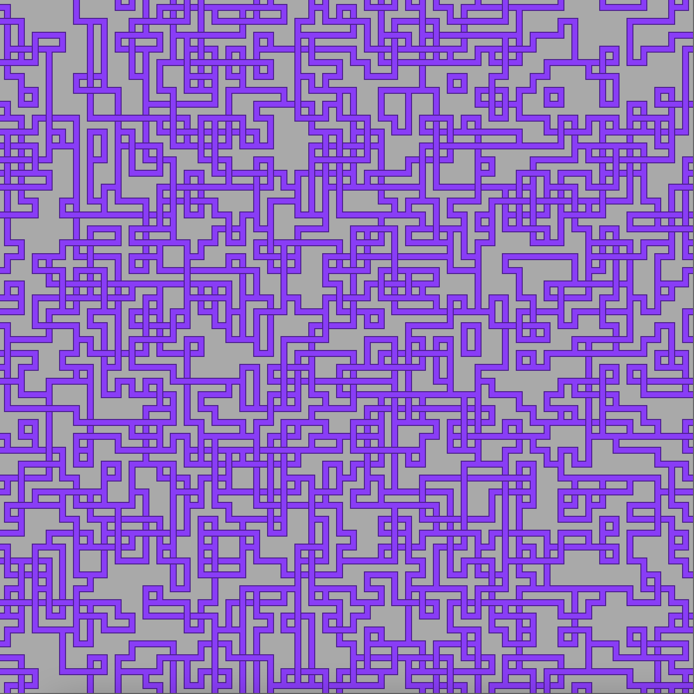

# WaveFunctionCollapse
Wave function collapse is a term from quantum physics that describes the behaviour of a set of valid states being collapsed into a single state. 
This project uses a tileset and evaluates the edges of the tiles automatically to determine which tiles can be placed next to eachother. 
Try creating your own tileset and watch as the program randomly decides among the possible solutions some unique solution following the rules defined by the images.
# [Live demo](https://ober3550.github.io/wavefunctioncollapse.html)
# Inspired by Dan Shiffman
This project is based on this [Wave Function Collapse](https://github.com/mxgmn/WaveFunctionCollapse).

